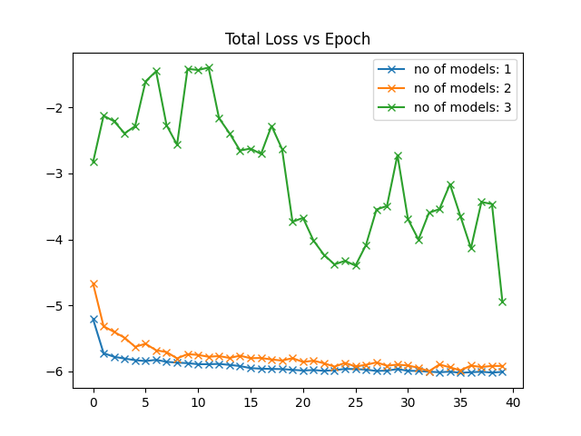
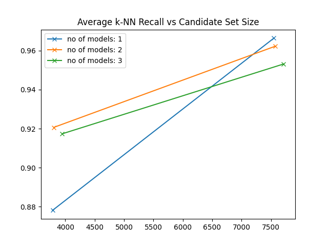

# Wrangling with a Neural Partitioner

This repository contains the code for a series of attempted enhancements made to the original [Neural Partitioner](https://github.com/abrar-fahim/Neural-Partitioner) from the paper [Unsupervised Space Partitioning for Nearest Neighbor Search](https://arxiv.org/abs/2206.08091), authored by Abrar Fahim, [Mohammed Eunus Ali](https://sites.google.com/site/mohammedeunusali/), and [Muhammad Aamir Cheema](http://www.aamircheema.com/).

For more detailed documentation and insights into how the various algorithms and models have been implemented, please refer to the implementation [report](report/sample-sigplan.pdf).

Included is also an incomplete implementation of the Hierarchical Navigable Small Worlds (HNSW) algorithm, originally intended as a potential enhancement for the ANN algorithm. The class developed as part of this attempt has been included in the repository for reference and future development. You can find this class in the [attempted-improvements](attempted-improvements/) folder.

---

## 📚 Contents
- [Code Structure](#code-structure)
  - [Getting Started](#getting-started)
  - [Setting Everything Up](#setting-everything-up)
    - [Prerequisites](#prerequisites)
    - [Installation](#installation)
- [Running The Code](#running-the-code)
  - [Running Locally](#running-locally)
  - [Running on Kaggle](#running-on-kaggle)
  - [Parameters For Running](#parameters)
- [Output Example](#output-example)
  - [Plots](#plots)
  - [Run Summary](#run-summary)

##  Code Structure

###  Getting Started
Begin by taking a look at [main.py](src/main.py), which serves as the entry point of the code. It relies on the [paths.txt](src/paths.txt) file to determine the locations of the datasets needed for training. Before proceeding, ensure that all the required dependencies mentioned in [requirements.txt](src/requirements.txt) are installed.

You could of course skip all that, by running a ready-to-go setup on Kaggle. More on that [in a bit](#running-on-kaggle).

### Setting Everything Up

Ensure that the file [paths.txt](src/paths.txt) specifies the absolute directory paths necessary for the code to function. It should include:
- `paths_to_mnist`: Directory containing the MNIST dataset in `hdf5` format.
- `path_to_sift`: Similar to `paths_to_mnist`, but for the SIFT dataset.
- `path_to_knn_matrix`: Directory where the generated k-NN matrix will be stored.
- `path_to_models`: Directory for saving trained models.
- `path_to_tensors`: Directory for storing processed tensors for faster re-runs.

#### Prerequisites
- Python 3.5+
- Compatible with Windows, Linux, macOS
- (Optional, although ideal) GPU support for faster computation

#### Installation

For starters, clone the repository:

```bash
git clone git@github.com:DSIT-DB-Course/phase-3-implementation-darmanis_kotsis.git
cd phase-3-implementation-darmanis_kotsis
```

Before running the code, install the required dependencies by running the following command:

```bash
pip install -r src/requirements.txt
```

## Running the Code

Two versions of the running workflow are available; locally and on Kaggle.

### Running Locally
Before running the code, fill in [paths.txt](paths.txt) with the appropriate directories. Next, download the [SIFT](http://corpus-texmex.irisa.fr/) and/or [MNIST](http://yann.lecun.com/exdb/mnist/) datasets from [ANN Benchmarks](https://github.com/erikbern/ann-benchmarks#data-sets) and place them in the respective folders specified in [paths.txt](paths.txt).

To execute the code with the default configuration, merely type:

```bash
python main.py
```

For a custom configuration, here's an example command:

```bash
python main.py --n_bins 256 --dataset_name mnist --n_trees 3 --metric_distance mahalanobis --model_combine cnn neural linear
```

### Running on Kaggle

We have automated the process to rerun all the experiments performed using an accelerated Kaggle notebook. This allows you to easily replicate and explore the results without the hassle of manual setup; for more details see [here](src/kaggle-notebook).

### Parameters for running
Default parameter values are set in [utils.py](src/utils.py).

#### Data Partitioning:
- `dataset_name`: Choose the dataset to partition (`mnist` or `sift`).
- `n_bins`: Define the number of bins for dataset partitioning.
- `k_train`: Set the number of neighbors to build the k-NN matrix.
- `k_test`: Set the number of neighbors for testing the model.
- `n_bins_to_search`: Choose how many bins to search for nearest neighbors.

#### Model Training:
- `n_epochs`: Specify the number of epochs for training.
- `batch_size`: Set the batch size.
- `lr`: Define the learning rate.
- `n_trees`: Choose the number of trees for ensemble.
- `n_levels`: Define the number of levels in each tree.
- `tree_branching`: Set the number of children per node.
- `model_type`: Select the model type (`neural`, `linear`, or `cnn`).
- `eta_value`: Balance parameter for the loss function.
- `distance_metric`: Choose distance metric (`euclidean` or `mahalanobis`).
- `model_combination`: Create an ensemble by combining models in the order provided.

### Quantization Pipeline:
- `pl`:  run vector quantization pipeline after ensemble model

It works with default values i tested for now (easily extended with args, just not yet), also it runs for one query point for MNIST and returns it's indices in the training set from the bins it was assigned (again easily extensible to more points in the running for loop and for SIFT it just needs to change the default values.)
Initial Dimension should divide number of centroids in total and number of subvectors to calculate the dimensions/subvector.
##### Used Values :
  512 centroids in total
  8 subvectors
  512/8 = 64 centroids/subvector
  98 dimensions/subvector (784/8)
  784 = 98 x 8
  In essence dimensions_for_subvector = initial_dimensions/number_of_subvectors
  centroids_for_subvector = total_centroids/number_of_subvectors


#### Storing Options:
- `load_knn`: Load the k-NN matrix from file (if available).
- `continue_train`: Continue training from the last checkpoint by loading models from file.

## Output Example

### Loss and Accuracy (RNN-Recall)
The program outputs the loss and accuracy (RNN-Recall) metrics and these metrics are highlighted in the plots. Additionally, a summary of the plots is displayed in the command prompt.

### Plots

<p align="center">
  
&nbsp; &nbsp; &nbsp; &nbsp;
  
</p>

Plots show loss per epoch and accuracy (RNN recall) per bin (partition) size for each neural ensemble, for a 16-bin space partition. The two most likely partitions to which the queries belong are indicated by the points on each line.

### Run Summary
The program outputs information about test accuracy, mean candidate set size, average query time, and its standard deviation for various combinations of the number of models and bins.

Example:
```
-- READING PATHS --
preparing knn with k =  10
BUILDING TREE
...
----- CALCULATING K-NN RECALL FOR EACH POINT -------
1 models, 1 bins
mean accuracy  tensor(0.9272)
mean candidate set size tensor(8918.8584)
average query time: 0.21, standard deviation: 0.03 (miliseconds)
...
```

All the run experiments are in the [outputs](src/kaggle-notebook/outputs/) and files are named using the convention `method-bin_number-dataset`. For example, if the method used was `cnn`, bin number was `16`, and dataset was `sift`, the output file would be named `cnn-16-sift.txt`.
