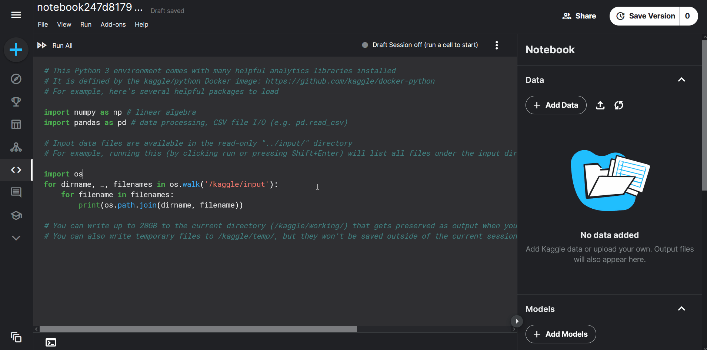
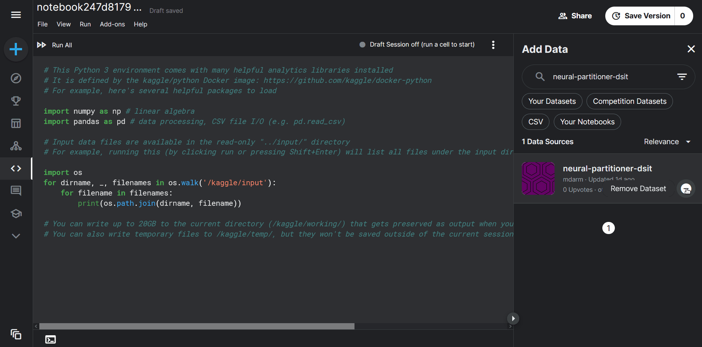

## Running the code in Kaggle

This section offers a comprehensive guide on how to execute this project using a Kaggle notebook. By following these steps, you will be able to upload the notebook to Kaggle, add the necessary data, and observe the output. **Please be aware that the Accelerated mode (e.g., GPU T100) is only available to verified Kaggle accounts.**

### Step-by-Step Instructions:

This guide serves as a demonstration to help you seamlessly run the code on Kaggle. Please ensure that you follow the instructions carefully. After some time, the output files will be generated and ready. You can locate these files by navigating to the specified path: `/kaggle/working`.

1. **Create a new Kaggle notebook.**
    - Sign in to your Kaggle account, navigate to the 'Notebooks' section, and click on 'New Notebook'.

2. **Add the required data.**
    - This includes Python modules and datasets from [ANN Benchmarks](https://github.com/erikbern/ann-benchmarks#data-sets).
    - Click on the 'Add data' button in the notebook.
    - Type "neural-partitioner-dsit" in the search bar that appears, and add the data to your notebook.

       

3. **Set up the working environment.**
    - Ensure that the session is running in Accelerated mode (GPU T100).
    - Run the following command to create the necessary directories. This is vital as the code explicitly refers to these paths (`paths.txt`).
    
    ```bash
    !mkdir /kaggle/working/models /kaggle/working/tensors
    ```
   
     

4. **Navigate to the code directory.**
    - Execute the following command to change to the code's directory:
   
    ```bash
    cd /kaggle/input/neural-partitioner-dsit
    ```

5. **Execute the main file with a custom configuration.**
    - Finally run the `main.py` file with all the necessary parameters:
    
    ```bash
    !python main.py --k_train 3 --k_test 3 --n_epochs 1 --dataset_name sift --model_type neural --n_levels 3 > /kaggle/working/output.txt 2>&1
    ```
    
    This command will execute the `main.py` file and direct the output to a file named `output.txt` in the `/kaggle/working` directory.

### Bulk experiment rerun

You can now automatically rerun all experiments in one go with an improved Kaggle notebook. Just upload this [notebook](neural-partitioner.ipynb) to Kaggle and download the dataset as guided before.

### Accessing the Outputs:

Once the code execution is complete, you can download the generated output files. These files are named using the convention `method-bin_number-dataset`. For example, if the method used was `cnn`, bin number was `16`, and dataset was `sift`, the output file would be named `cnn-16-sift.txt`.
